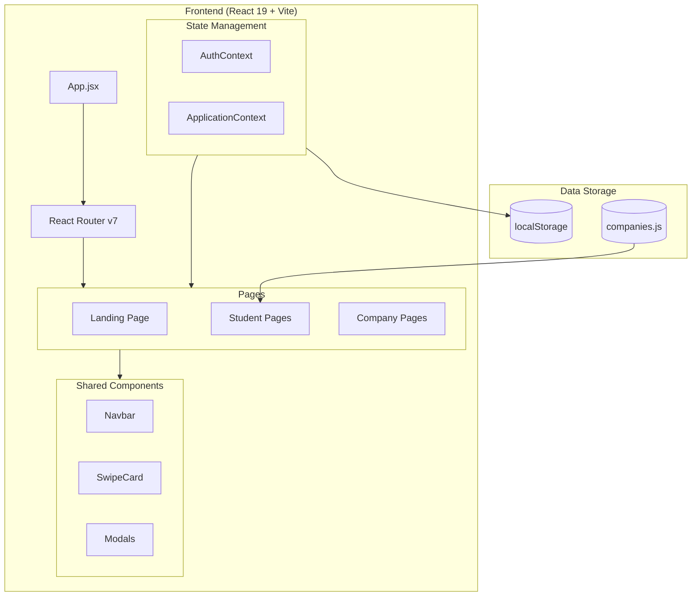
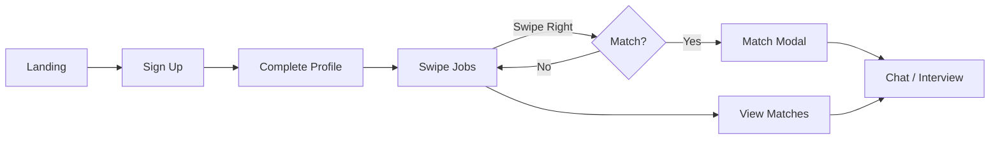
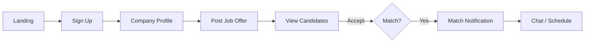

# MatchOp Documentation

> **Match Your Opportunity** - A Tinder-style student-company matching platform for internships in Tunisia.

---

## Table of Contents

1. [Project Overview](#project-overview)
2. [Architecture](#architecture)
3. [Folder Structure](#folder-structure)  
4. [Technology Stack](#technology-stack)
5. [Components Reference](#components-reference)
6. [Page Reference](#page-reference)
7. [State Management](#state-management)
8. [Data Layer](#data-layer)
9. [User Flows](#user-flows)
10. [API Integration (Future)](#api-integration)
11. [Internationalization](#internationalization)
12. [Best Practices](#best-practices)
13. [Recommendations](#recommendations)

---

## Project Overview

**MatchOp** is a modern web application that connects Tunisian students with internship opportunities using a swipe-based matching interface (similar to Tinder). 

### Key Features
- **Role-based system**: Separate flows for Students and Companies
- **Swipe matching**: Students swipe right to apply, companies swipe to accept
- **Real-time matching**: When both parties swipe right, it's a match!
- **Profile sharing**: Student CV/portfolio sent automatically on application
- **Interview scheduling**: Match modal shows next steps

---

## Architecture



### Current State
- **Frontend-only** React SPA with localStorage persistence
- **Mock data** for 90 Tunisian companies with job offers
- Ready for **Supabase integration** (backend placeholder)

---

## Folder Structure

```
matchop/
├── public/                    # Static assets
│   ├── images/               # Logos, mockups
│   └── styles.css            # Global styles
│
├── src/
│   ├── assets/               # App assets (images, fonts)
│   │
│   ├── components/           # Reusable UI components
│   │   ├── Navbar.jsx        # Navigation bar
│   │   ├── SwipeCard.jsx     # Swipeable job card
│   │   ├── MatchModal.jsx    # Match celebration modal
│   │   ├── OfferDetailModal.jsx
│   │   ├── ApplicationToast.jsx
│   │   ├── LoadingScreen.jsx
│   │   ├── Logo.jsx
│   │   └── ChatBubble.jsx
│   │
│   ├── context/              # React contexts
│   │   ├── AuthContext.jsx   # Authentication state
│   │   └── ApplicationContext.jsx  # Job applications
│   │
│   ├── data/                 # Mock data
│   │   └── companies.js      # 90 Tunisian companies
│   │
│   ├── lib/                  # Utilities
│   │   └── i18n.js           # i18next config
│   │
│   ├── locales/              # Translations
│   │   ├── en/translation.json
│   │   └── fr/translation.json
│   │
│   ├── pages/                # Route pages
│   │   ├── Landing.jsx       # Home page
│   │   ├── student/          # Student pages (11 files)
│   │   └── company/          # Company pages (9 files)
│   │
│   ├── types/                # TypeScript types
│   │   └── index.d.ts
│   │
│   ├── App.jsx               # Main app with routing
│   ├── App.css
│   ├── main.jsx              # Entry point
│   └── index.css             # Design system
│
├── package.json
├── vite.config.js
└── README.md
```

---

## Technology Stack

| Category | Technology | Version |
|----------|------------|---------|
| Framework | React | 19.2.0 |
| Build Tool | Vite | 7.2.4 |
| Routing | react-router-dom | 7.11.0 |
| Icons | lucide-react | 0.561.0 |
| i18n | i18next + react-i18next | 23.x / 14.x |
| Styling | Vanilla CSS (CSS Variables) | - |

### Future Stack (Recommended)
- **Backend**: Supabase (Auth + Database + Storage)
- **Database**: PostgreSQL (via Supabase)
- **Real-time**: Supabase Realtime

---

## Components Reference

### Core Components

| Component | Purpose | Props |
|-----------|---------|-------|
| `Navbar` | Top navigation with role-based links | - |
| `SwipeCard` | Draggable job offer card | `offer`, `onSwipe`, `isTop` |
| `MatchModal` | Match celebration + interview details | `match`, `onClose`, `userType` |
| `OfferDetailModal` | Full job details view | `offer`, `onClose` |
| `ApplicationToast` | "Application sent" notification | `companyName`, `onClose` |
| `LoadingScreen` | Initial app loading animation | `minDuration`, `onComplete` |
| `Logo` | Animated MatchOp logo | `size`, `animated` |
| `ChatBubble` | Chat message bubble | `message`, `isOwn` |

### SwipeCard Component

```jsx
<SwipeCard
    offer={{
        id: 1,
        company: "InstaDeep",
        title: "ML Engineer Intern",
        location: "Tunis",
        salary: "2500 TND/month",
        skills: ["Python", "TensorFlow"],
        hasMatched: false
    }}
    onSwipe={(direction) => handleSwipe(direction)}
    onViewDetails={(offer) => setSelectedOffer(offer)}
    isTop={true}
/>
```

---

## Page Reference

### Student Pages

| Route | Component | Description |
|-------|-----------|-------------|
| `/student/signup` | StudentSignup.jsx | Registration with profile info |
| `/student/login` | StudentLogin.jsx | Email/password login |
| `/student/profile` | StudentProfile.jsx | Edit CV, links, skills |
| `/student/swipe` | StudentSwipe.jsx | Main swipe interface |
| `/student/matches` | StudentMatches.jsx | View all matches |
| `/student/chat/:id` | StudentChat.jsx | Chat with company |

### Company Pages

| Route | Component | Description |
|-------|-----------|-------------|
| `/company/signup` | CompanySignup.jsx | Company registration |
| `/company/login` | CompanyLogin.jsx | Company login |
| `/company/profile` | CompanyProfile.jsx | Edit company info |
| `/company/post-offer` | PostOffer.jsx | Create job offers |
| `/company/candidates` | ViewCandidates.jsx | View applicants |
| `/company/matches` | CompanyMatches.jsx | View matches |
| `/company/chat/:id` | CompanyChat.jsx | Chat with student |

---

## State Management

### AuthContext

Manages user authentication with localStorage persistence.

```jsx
const { user, isLoggedIn, isStudent, isCompany, login, logout } = useAuth()

// User object structure
{
    type: 'student' | 'company',
    name: string,
    email: string,
    profile: {...},  // Student profile data
    loggedInAt: ISO timestamp
}
```

### ApplicationContext

Tracks student applications (right swipes).

```jsx
const { 
    applications,           // All applications
    recentApplication,      // For toast notification
    addApplication,         // On right swipe
    hasAppliedTo,          // Check if applied
    updateApplicationStatus // Update status
} = useApplications()

// Application object structure
{
    id: number,
    companyId: number,
    companyName: string,
    position: string,
    appliedAt: ISO timestamp,
    status: 'pending' | 'matched' | 'rejected',
    userProfile: {...}
}
```

---

## Data Layer

### Companies Database (`companies.js`)

Contains **90 Tunisian companies** with generated job offers.

```javascript
// Company structure
{
    id: number,
    name: string,
    website: string,
    sector: string,        // AI, Fintech, HealthTech, etc.
    location: string,
    size: '20+' | '50+' | '100+' | '500+' | '1000+',
    description: string,
    contact_email: string,
    offers_count: number
}

// Generated offer structure
{
    id: number,
    company: string,
    title: string,
    description: string,
    location: string,
    salary: string,
    skills: string[],
    requirements: string[],
    hasMatched: boolean    // ~30% random
}
```

### Sectors Covered
AI, Fintech, HealthTech, Cleantech, Big Data, ERP, FMCG, Logistics, IT, Agriculture, EdTech, Tourism, Hotels, Banking, Airline, Chemical, Industry, BTP, Electronics, Automotive, and more.

---

## User Flows

### Student Flow



### Company Flow



---

## API Integration

### Recommended Supabase Schema

```sql
-- Users table (handled by Supabase Auth)
-- Extended with profiles

CREATE TABLE profiles (
    id UUID PRIMARY KEY REFERENCES auth.users(id),
    type TEXT CHECK (type IN ('student', 'company')),
    name TEXT,
    email TEXT,
    avatar_url TEXT,
    created_at TIMESTAMPTZ DEFAULT NOW()
);

CREATE TABLE student_profiles (
    id UUID PRIMARY KEY REFERENCES profiles(id),
    bio TEXT,
    location TEXT,
    linkedin_url TEXT,
    github_url TEXT,
    portfolio_url TEXT,
    behance_url TEXT,
    cv_url TEXT,
    skills TEXT[],
    experience TEXT,
    availability TEXT
);

CREATE TABLE companies (
    id UUID PRIMARY KEY REFERENCES profiles(id),
    website TEXT,
    sector TEXT,
    size TEXT,
    description TEXT,
    logo_url TEXT
);

CREATE TABLE job_offers (
    id UUID PRIMARY KEY DEFAULT gen_random_uuid(),
    company_id UUID REFERENCES companies(id),
    title TEXT NOT NULL,
    description TEXT,
    location TEXT,
    salary_min INT,
    salary_max INT,
    skills TEXT[],
    requirements TEXT[],
    created_at TIMESTAMPTZ DEFAULT NOW()
);

CREATE TABLE applications (
    id UUID PRIMARY KEY DEFAULT gen_random_uuid(),
    student_id UUID REFERENCES student_profiles(id),
    offer_id UUID REFERENCES job_offers(id),
    status TEXT DEFAULT 'pending',
    applied_at TIMESTAMPTZ DEFAULT NOW(),
    UNIQUE(student_id, offer_id)
);

CREATE TABLE matches (
    id UUID PRIMARY KEY DEFAULT gen_random_uuid(),
    application_id UUID REFERENCES applications(id),
    matched_at TIMESTAMPTZ DEFAULT NOW()
);

CREATE TABLE messages (
    id UUID PRIMARY KEY DEFAULT gen_random_uuid(),
    match_id UUID REFERENCES matches(id),
    sender_id UUID REFERENCES profiles(id),
    content TEXT,
    sent_at TIMESTAMPTZ DEFAULT NOW()
);
```

---

## Internationalization

### Supported Languages
- **English** (default)
- **French**

### Usage

```jsx
import { useTranslation } from 'react-i18next'

function MyComponent() {
    const { t, i18n } = useTranslation()
    
    return (
        <h1>{t('welcome')}</h1>
    )
}
```

### Adding Translations
Edit files in `src/locales/{lang}/translation.json`

---

## Best Practices

### Current Implementation

✅ **Component-based architecture** - Clean separation of concerns  
✅ **Context API for state** - Appropriate for this app size  
✅ **CSS Variables design system** - Consistent theming  
✅ **localStorage persistence** - Works offline  
✅ **Role-based routing** - Separate student/company flows  
✅ **Responsive design** - Mobile-first approach  

### Code Style

- Components use PascalCase
- CSS files co-located with components
- Prop destructuring in function signatures
- Hooks at top of components
- Comments for complex logic

---

## Recommendations

### High Priority

1. **Add Supabase Backend**
   - Replace localStorage with Supabase
   - Add real authentication
   - Enable real-time chat

2. **Add Route Protection**
   ```jsx
   // ProtectedRoute component
   function ProtectedRoute({ children, requiredRole }) {
       const { isLoggedIn, user } = useAuth()
       if (!isLoggedIn || user?.type !== requiredRole) {
           return <Navigate to="/login" />
       }
       return children
   }
   ```

3. **Add Error Boundaries**
   - Catch and display errors gracefully

### Medium Priority

4. **Add form validation** (react-hook-form + zod)
5. **Add loading states** for async operations
6. **Add pagination** for companies list
7. **Add search/filter** for job offers
8. **Add dark/light theme toggle**

### Nice to Have

9. **PWA support** - Add service worker
10. **Analytics** - Track user engagement
11. **Email notifications** - New match alerts
12. **Mobile app** - React Native version

---

## Quick Start

```bash
# Install dependencies
npm install

# Start dev server
npm run dev

# Build for production
npm run build
```

## Environment Variables

Create `.env` file based on `.env.example`:

```env
VITE_SUPABASE_URL=your_supabase_url
VITE_SUPABASE_ANON_KEY=your_anon_key
```

---

*Generated for MatchOp v1.0.0*
